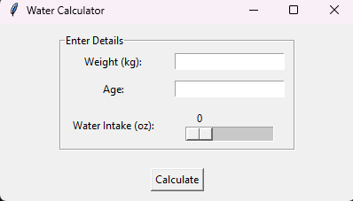

# Water Calculator Application

The **Water Calculator** is a simple Python application that helps individuals calculate their recommended water intake based on their weight and age. It provides an estimation of the daily water intake needed to stay hydrated.

> "Water is the driving force of all nature." - Leonardo da Vinci



## Features

- Calculates water intake based on weight and age
- Provides a recommendation on whether the water intake is sufficient or needs improvement

## Prerequisites

- Python 3.x
- `tkinter` library (usually comes pre-installed with Python)

## Installation

1. Clone the repository:


   git clone https://github.com/your-username/water-calculator.git
Navigate to the project directory:

bash
Copy code
cd water-calculator
Run the application:

Certainly! Here's the updated Markdown text with the provided additional details:


# Water Calculator Application

The **Water Calculator** is a simple Python application that helps individuals calculate their recommended water intake based on their weight and age. It provides an estimation of the daily water intake needed to stay hydrated.

> "Drink water like it's your job." - Unknown

## Usage

1. Enter your weight in kilograms.
2. Enter your age.
3. Click the **Calculate** button.
4. The application will display your recommended water intake.

## Methodology

The water intake calculation in the Water Calculator is based on the following formula:

```
water_intake = (weight / 2.2) * (age / 28.3) / 8
```

The weight is divided by 2.2 to convert it from kilograms to pounds, and the age is divided by 28.3 to convert it from years to months. The result is then divided by 8 to convert it from fluid ounces to cups. This calculation provides an estimation of the recommended water intake.

## Contributing

Contributions to the Water Calculator project are welcome! If you have any ideas for improvements or find any issues, please feel free to open an issue or submit a pull request. Any contributions are *highly* appreciated.

## License

This project is licensed under the [MIT License](LICENSE).

## Acknowledgments

- The `tkinter` library for providing the GUI components used in the application.
- The Python community for their valuable contributions.

## Contact

If you have any questions, suggestions, or feedback, please feel free to contact the project maintainer at [your-email@example.com](mailto:your-email@example.com).
```

Please note that you need to replace `[your-email@example.com](mailto:your-email@example.com)` with your actual email address to make it a clickable link.

Thank you for using the Water Calculator application! Stay hydrated and healthy! :droplet::sweat_drops:
